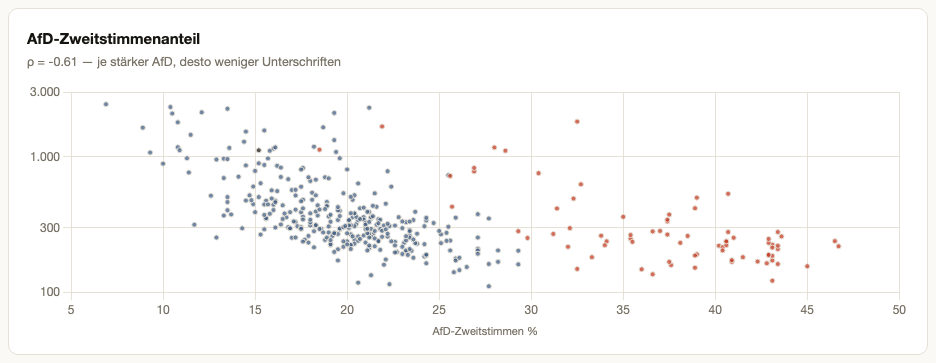
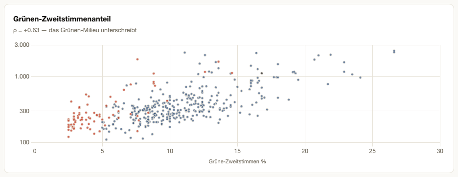
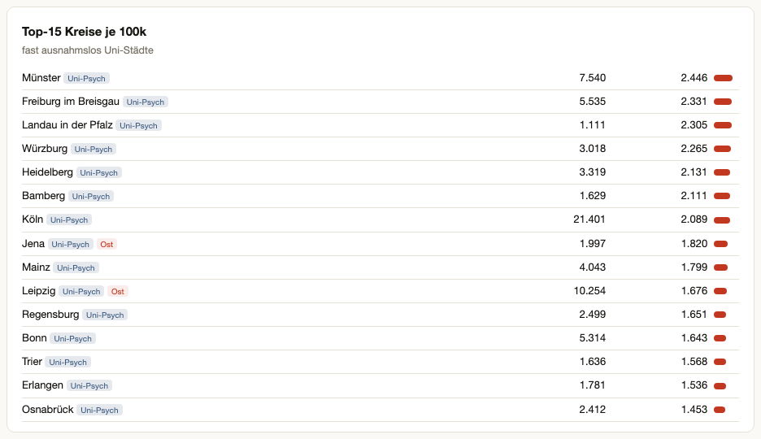
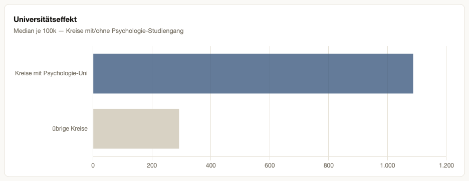
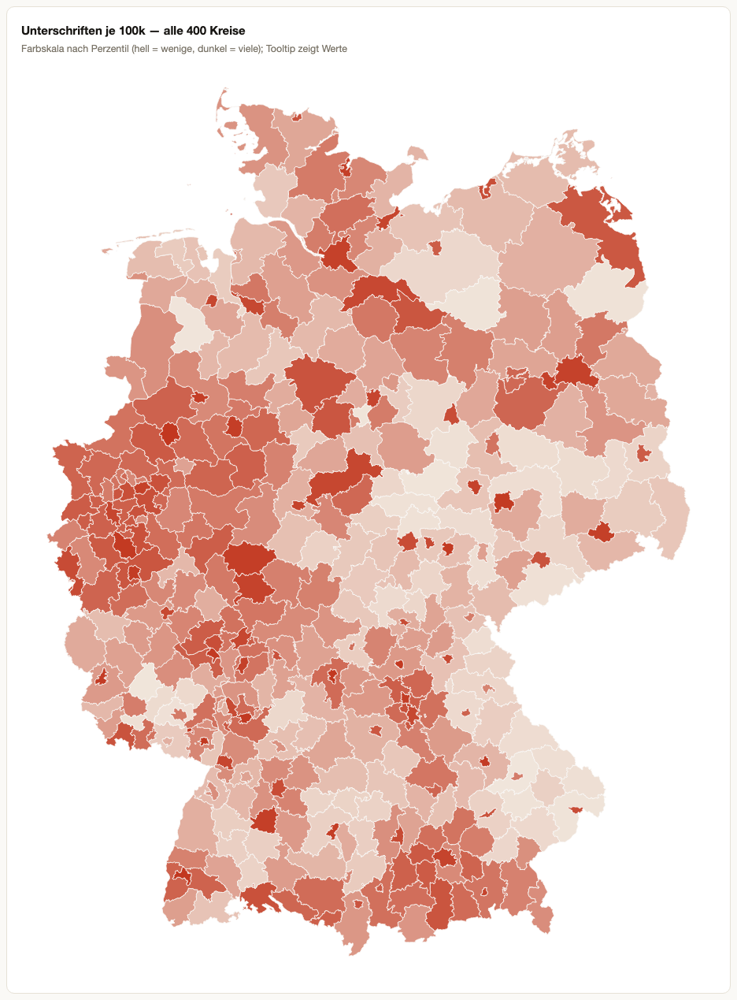
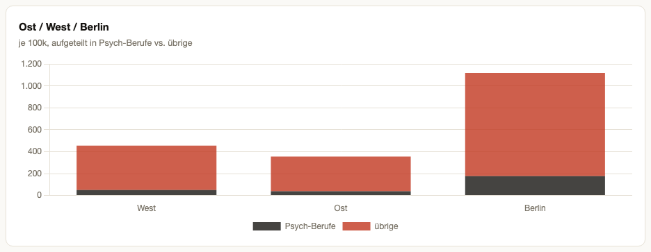
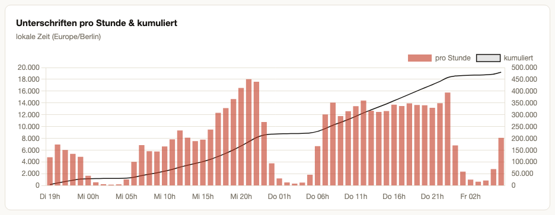
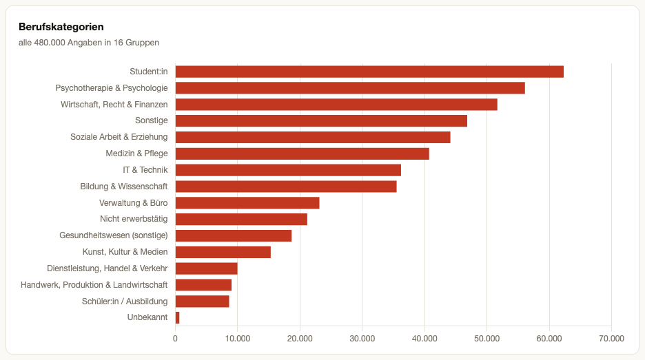
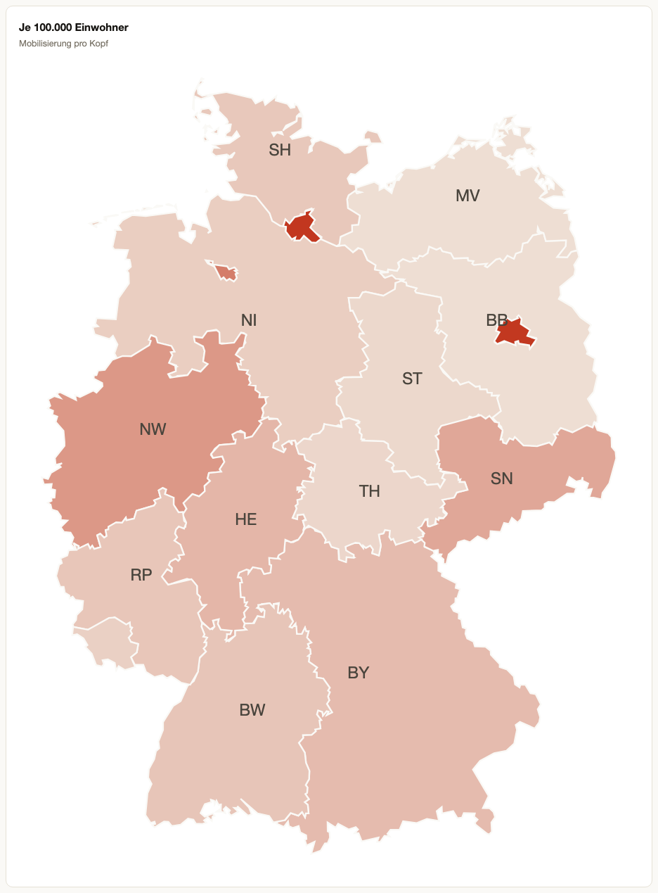

# Petition Signature Analysis — 480k signatures, district-level demographics

Exploratory analysis of ~480,000 signatures from a German (psychotherapy-related) online
petition, collected over a 60-hour window in July 2026. The project cleans the raw
signature export, enriches it with official reference data down to the **Kreis**
(district) level, and renders a single self-contained HTML report.

**→ Open [`Uschriften_report.html`](Uschriften_report.html)** — fully standalone
(all data and libraries inlined, no network or source files required).

> **Privacy:** the raw signature data (names, free-text occupation entries) is **not**
> part of this repository and is excluded via `.gitignore`. The repo contains only the
> rendered report, aggregated district-level statistics (`kreis_stats.csv`, minimum
> granularity: one of 400 Kreise), public open data, and the pipeline code.

**Tooling note:** this entire analysis — cleaning, enrichment, statistics, report and
repo — was built with **Claude Fable** (Anthropic, via Claude Code) in **5 prompts**,
roughly **300k tokens** and about **two hours** of wall-clock time.

---

## Key findings

### It's a milieu map, not a need map

Signatures per 100k inhabitants across all 400 German districts correlate strongly with
the district's Green vote share (Spearman ρ = **+0.63**) and negatively with the AfD
share (ρ = **−0.61**) in the 2025 federal election. Socioeconomic deprivation (RKI GISD)
explains almost nothing (ρ = −0.24): the petition was *not* signed where hardship —
and, by proxy, mental-health burden — is highest. The top-AfD quintile of districts
produces ~4× fewer signatures per capita than the bottom quintile.




### The strongest single factor is a psychology department

Districts hosting a university psychology programme reach a median of **~1,090
signatures per 100k** vs. **~290** elsewhere — factor **3.6**. The top-15 list is
essentially a list of university towns (Münster, Freiburg, Würzburg, Heidelberg,
Bamberg, Köln …). Together with students being the largest signer group (13%), the
diffusion pattern looks like university/professional networks, not general public.




### The East is split, not absent

The district choropleth makes the former inner-German border visible: pale eastern
rural districts, but Leipzig, Jena and Dresden as dark islands at West-university
level — and Berlin leading everything (1,118 per 100k). In a joint regression
(R² = 0.67 on log per-100k: AfD share, Green share, GISD, population density, East
dummy), the East coefficient turns *positive* once AfD share is controlled: at equal
political milieu, the East signs just as much.




### Who signs, and when

~73% women (estimated), 33% from psychotherapy/health/social professions, students the
largest single group. The wave *accelerated* over two days instead of decaying — only
30% of signatures arrived in the first 24h; day 3 was the strongest (242,578).





---

## Methods

### 1. Cleaning (`clean_uschriften.py`)

Raw export columns: `id, academicTitle, firstName, lastName, berufsbezeichnung, ort, createdAt`.

- **Location:** `ort` mixed city names, bare zip codes and "zip + city" strings. Split
  into `plz` + `ort`; enriched both directions against GeoNames (zip → official city;
  city → zip only when the city has exactly one zip code). Typos/districts next to a
  valid zip are normalized to the official municipality.
- **Occupation:** 57k unique free-text job titles → 16 coarse categories via an
  order-sensitive keyword classifier (~10% end up in Sonstige/Unbekannt, dominated by
  genuinely ambiguous entries like "Angestellte").
- **Academic titles:** 5.5k spelling variants normalized to canonical forms
  (`Dr / Dr. / Doktor → Dr.`); binary `has_academic_title` = university degree only
  (Diplom/Magister/Staatsexamen = yes, Meister = no).

### 2. Gender estimate (no name database)

German job titles are grammatically gendered ("Lehrerin" vs. "Lehrer"). These forms
seed a per-first-name majority vote (assigned when ≥5 observations and ≥85% agreement),
which then classifies 98% of rows — including rows with gender-neutral occupations.
A language-based estimate, not self-reported.

### 3. District (Kreis) assignment

City-name-first, zip-fallback: official municipality names from the Destatis
Gemeindeverzeichnis (GV100), disambiguated by **population-weighted dominance ≥ 0.75**
(so "Oberhausen" resolves to the 210k city, not same-named villages), with short-name
aliases ("Landau" → "Landau in der Pfalz"). Fallback: GeoNames zip → admin3 (= AGS).
Coverage: **96.6%** of signatures mapped to one of 400 districts (AGS-5 keys).

### 4. Election data: Wahlkreis → Kreis apportionment

The Bundeswahlleiterin publishes 2025 results per *electoral* district (299 Wahlkreise),
which don't match administrative districts. Second votes are apportioned to Kreise via
population weights from the official Gemeinde→Wahlkreis mapping joined with GV100
municipality populations. The apportioned valid-vote total reconciles **exactly** with
the official count (49,649,512).

### 5. Statistics

Spearman correlations on 400 districts; standardized OLS on log10(per-100k) with
Green/AfD share, GISD, log density and an East dummy (R² = 0.67). All district-level
("ecological") correlations — no claims about individuals.

---

## Data fetches (all public open data)

| Dataset | URL | License |
|---|---|---|
| Election results BTW 2025 (kerg2, per Wahlkreis) | `https://www.bundeswahlleiterin.de/dam/jcr/f49a47a1-735b-4e9b-b4e1-4c73cad2292e/btw25_kerg2.csv` | DL-DE BY 2.0 |
| Gemeinde → Wahlkreis mapping | `https://www.bundeswahlleiterin.de/dam/jcr/aa868597-0e60-476c-bd2b-279c1e9a142a/btw25_wkr_gemeinden_20241130_utf8.csv` | DL-DE BY 2.0 |
| Wahlkreis structural data | `https://www.bundeswahlleiterin.de/dam/jcr/181f9e38-38db-4f64-991c-8141dfa0f2cb/btw2025_strukturdaten.csv` | DL-DE BY 2.0 |
| GISD deprivation index (RKI) | `https://raw.githubusercontent.com/robert-koch-institut/German_Index_of_Socioeconomic_Deprivation_GISD/main/GISD_Bund.tsv` | CC-BY 4.0 |
| Municipality register GV100 (population, area) | `https://www.destatis.de/DE/Themen/Laender-Regionen/Regionales/Gemeindeverzeichnis/Administrativ/Archiv/GVAuszugQ/AuszugGV4QAktuell.xlsx` | DL-DE BY 2.0 |
| Zip ↔ place ↔ district (GeoNames) | `https://download.geonames.org/export/zip/DE.zip` | CC-BY 4.0 |
| District geometries (400 Kreise, AGS codes) | `https://public.opendatasoft.com/api/explore/v2.1/catalog/datasets/georef-germany-kreis/exports/geojson` | opendatasoft public |
| State geometries | `https://raw.githubusercontent.com/isellsoap/deutschlandGeoJSON/main/2_bundeslaender/4_niedrig.geo.json` | dl-de/by-2-0 (BKG) |

Small political CSVs are committed under [`external/`](external/); large re-fetchable
files (GISD, GV100, GeoNames, geometries) are gitignored — see
[`external/README.md`](external/README.md).

**Known gap:** psychotherapist density per district (KBV Bundesarztregister /
Bedarfsplanung) is only available behind interactive portals
(gesundheitsdaten.kbv.de, versorgungsatlas.de) with no machine-readable export. The
supply-vs-need question is answered indirectly via GISD and the university effect.

---

## Repository contents

```
Uschriften_report.html   standalone one-page report (data + Chart.js inlined)
kreis_stats.csv          per-district aggregates: signatures, per-100k, party shares,
                         GISD, density, East/West, university flag
assets/                  chart screenshots (used above)
external/                committed political open data + source documentation
clean_uschriften.py      step 1: cleaning pipeline (raw CSV -> cleaned CSV)
kreis_pipeline.py        step 2: district assignment, election apportionment, kreis_stats
build_report.py          step 3: HTML report renderer
```

Reproduction requires the raw `Uschriften.csv` (not distributed) plus the fetches
above; then run the three scripts in order (pandas, numpy, scipy, openpyxl).

## Limitations

- Gender and district are **derived**, not self-reported; occupation categories are
  rule-based; the university list is approximate (~56 districts).
- District-level correlations; no individual-level inference.
- The observation window ends mid-wave (Friday morning) — totals are a floor.
- Signature location is free text; ~3.4% of rows remain unassignable.
